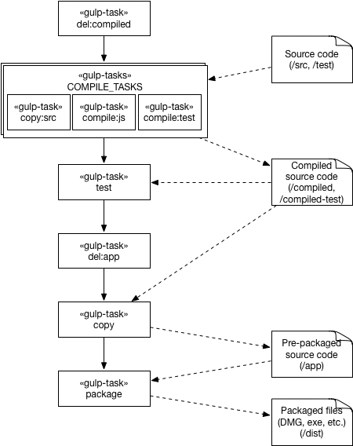

# 코드관점\(Code Viewpoint\) 아키텍처 문서
## 1. 아키텍처 스타일
## 2. 모델 종류들
### 2.1 <a name="CV-MK-1"></a>CV-MK-1 : 코드 파일 구조 모델 종류 정의
```
A
└── B
```
B는 A 디렉토리에 속한다.

### 2.2 <a name="CV-MK-2"></a>CV-MK-2: 빌드 구조 모델 종류 정의


빌드 도구로 Gulp를 이용하기 때문에 Gulp Task들이 주요한 구성요소가 된다.

## 3. 아키텍처 모델들 및 결정 사항들

### 3.1 <a name="CV-AD-1"></a>CV-AD-1: 1-level 코드 파일 구조 모델 ([CV-MK-1](#CV-MK-1) 적용)
```
.
├── src
├── test
├── compiled
├── compiled-test
├── maps
├── package.json
└── gulpfile.js
```

개발 및 테스트와 관련된 기본 코드 파일 구조 모델은 다음과 같다. `src` 디렉토리에 모든 소스코드가 속하고, `test` 디렉토리에 모든 테스트 코드가 속한다. `src`의 코드는 `compiled` 디렉토리로 트랜스파일 되고, `test`의 코드는 `compiled-test`로 트랜스파일된다. `maps`는 sourcemaps 파일들을 저장한다.

### 3.2 <a name="CV-AD-2"></a>CV-AD-2: 2-level 코드 파일 구조 모델 ([CV-MK-1](#CV-MK-1) 적용)
```
src
├── mainWindow
|   ├── components
|   ├── flux
|   ├── util
|   ├── css
|   ├── container.jsx
|   └── index.html
├── addWindow
├── main
|   └── main.js
└── util
    └── flux
```

[CV-AD-1](#CV-AD-1)의 `src` 디렉토리를 분할한 모델이다. `components`에는 `container.jsx`를 제외한 모든 react 파일들이 저장된다. `container.jsx`는 `index.html`에 바로 embed 되기 때문에, 논리적 계층 구조를 동일하게 유지하기 위하여 `index.html`과 동일한 위치에 둔다.

### 3.3 <a name="CV-AD-3"></a>CV-AD-3: 빌드 구조 모델 ([CV-MK-2](#CV-MK-2) 적용)



개발 중 프로그램 실행은 2번째 생산되는 출력 파일들인 Compiled source code를 이용한다.

### 3.4 코딩 스탠다드 결정
[](https://github.com/feross/standard)

## 추적성
Module View | Code View
------------|-----------
`MainApp Layer`/`Main` | `src`/`main`
`Window Layer`/`AddWindow` | `src`/`addWindow`
`Window Layer`/`MainWindow` | `src`/`mainWindow`
`Window Layer`/`MainWindow`/`UI`/`UI Components` | `src`/`mainWindow`/`components`
`Window Layer`/`MainWindow`/`UI`/`Web Files` | `src`/`mainWindow`/`index.html`, `mainWindow`/`css`
`Window Layer`/`MainWindow`/`UI`/`Container` | `src`/`mainWindow`/`container.jsx`
`Window Layer`/`MainWindow`/`Flux` | `src`/`mainWindow`/`flux`
`Common Layer`/`Util` | `src`/`util`
`Common Layer`/`Util`/`Flux` | `src`/`util`/`flux`
`Common Layer`/`Util`/`Const` | `src`/`util`
