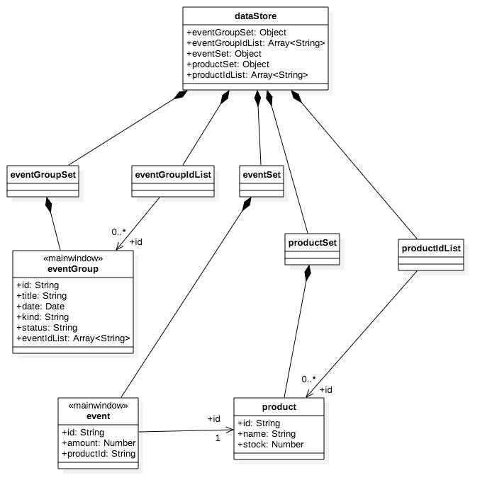
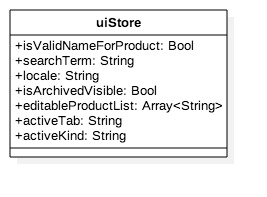
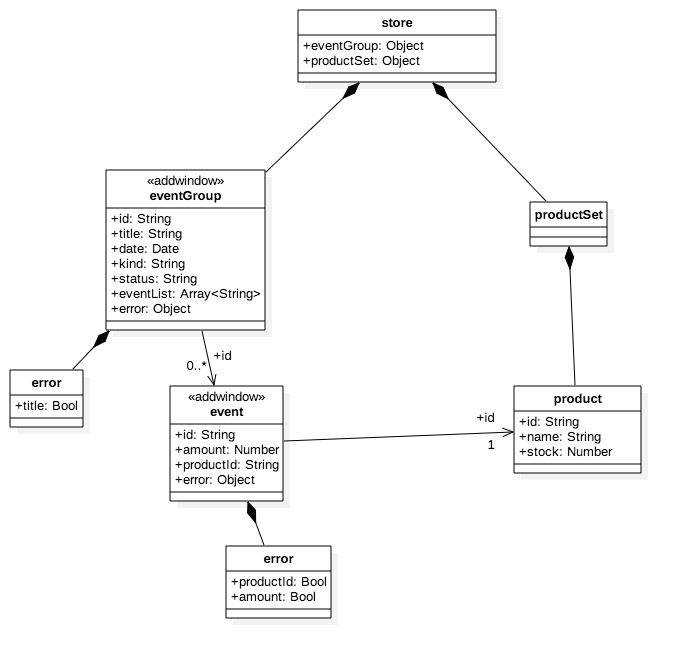

# 상세 디자인 문서

아키텍처 뷰에 정의된 아키텍처 모델들은 추상화 수준이 높고, 왠만해서는 변경이 되지 않는 영역이다. 반면에 상세 설계는 코드에 바로 반영이 되는 구체적인 실행 흐름이나 데이터 구조를 정의한다.

## Store 구조
### mainWindow의 Store
[코드관점 아키텍처 뷰](./code-viewpoint.md)의 `src/mainWindow/flux`에 속하는 Store 구조를 정의한다. `mainWindow`는 2개의 분리된 Store로 구성되며, 각각 `store.data.js`, `store.ui.js`에 저장된다. `store.data.js`는 Data Store([DD-MV-4](#DD-MV-4))에 저장되는 내용이고, `store.ui.js`는 저장되지 않는 UI 값을 의미한다.

#### <a name="DD-MV-1"></a>DD-MV-1: `store.data.js`


#### <a name="DD-MV-2"></a>DD-MV-2: `store.ui.js`


### addWindow의 Store
[코드관점 아키텍처 뷰](./code-viewpoint.md)의 `src/addWindow/flux`에 속하는 Store 구조를 정의한다. `addWindow`의 경우 단일 Store를 유지한다.

#### <a name="DD-MV-3"></a>DD-MV-3: `store.js`


## <a name="DD-MV-4"></a>DD-MV-4: Data Store ([LV-AD-1](./logical-viewpoint.md#LV-AD-1)의 LC04) 구조

```
{
    dbRevision: Number,
    /** DD-MV-1 **/
    eventGroupSet: Object,
    eventGroupIdList: Array,
    productIdList: Array,
    productSet: Object,
    eventSet: Object
    /*************/
}
```