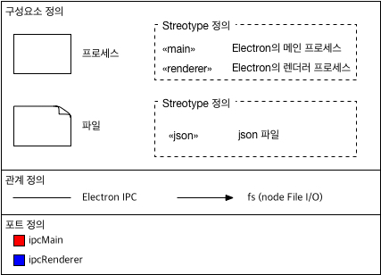

# 논리관점\(Logical Viewpoint\) 아키텍처 문서

## 1. 아키텍처 스타일

MyWorkshop:Stock은 [React](https://facebook.github.io/react/), [Electron](http://electron.atom.io)이라는 기술 스택이 이미 정해진 프로젝트이기 때문에, 해당 기술에서 강제하는, 또는 권장하는 아키텍처 스타일을 적용한다.

### AD-AS-1: Client-Server 아키텍처 스타일 적용
Electron은 기본적으로 Client-Server 아키텍처 스타일로 구성되어있다. 즉, 메인 프로세스가 Server 역할을 하고, 렌더러 프로세스가 Client 역할을 수행한다.

### AD-AS-2: [Flux 아키텍처 스타일](https://facebook.github.io/flux/) 적용
Flux 아키텍처 스타일은 Facebook에서 제안한 아키텍처 스타일로, MVC 아키텍처 스타일을 대체하는(또는 한다고 주장하는) 아키텍처 스타일이다. React와 함께 사용하면 복잡성을 낮추고, 테스트에 용이하기 때문에 Client에 적용한다. AD-AS-1로 인해 메인 프로세스와 렌더러 프로세스는 완전히 따로 작동하며, 메인 프로세스에는 UI가 없기 때문에 복잡성을 낮추기 위해 Flux 아키텍처 스타일은 렌더러 프로세스에만 적용한다.

#### 대안: 메인-렌더러 프로세스에 걸쳐 하나의 Flux 아키텍처 스타일 구조를 유지
Action을 dispatch 하고 업데이트된 Store를 다시 UI에 반영하기 위해 많은 IPC 호출이 필요할 것으로 생각된다. 그리고 Store 자체가 단순 JSON 형태로 저장되어 있는 만큼, 현재는 불필요한 복잡성만을 유발할 것으로 생각된다. 하지만 향후 메인 프로세스에 embedded DB가 추가되면, 이러한 구조 변경을 고려할 수 있다.

## 2. 모델 종류들

### 2.1 LV-MK-1: 1-level 논리뷰 아키텍처 모델 종류 정의

1-level은 가장 추상수준이 높은(즉 제일 먼저 설계하는) 모델을 의미한다.

### 2.2 LV-MK-2: 2-level 논리뷰 아키텍처 모델 종류 정의

실행 컴포넌트는 정확히는 JavaScript 파일들의 집합이다. Java와 같은 컴파일 언어와는 다르게, JavaScript는 소스코드들이 곧 실행 컴포넌트가 된다. (참으로 편한 언어라고 할 수 있다.)

JavaScript도 물론 클래스가 있고 객체가 있다. 하지만 MyWorkshop:Stock에서는 기본적으로 '파일' 단위로 프로그래밍이 되었다. Java 프로그램의 경우 클래스가 곧 파일이 되고, 이 클래스들의 객체가 실행 측면에서 중요한 요소가 되지만, 현재 MyWorkshop:Stock은 그렇지 않다. 그렇기 때문에, [LV-MK-2](#LV-MK-2) 수준의 모델 종류에서 만족하기로 한다.

## 3. 아키텍처 모델들

아키텍처 모델은 기본적으로 아키텍처 결정사항들의 집합이다. 예를 들면, "컴포넌트 A를 만들고, 컴포넌트 B를 만들고, 컴포넌트 A와 컴포넌트 B는 관계1로 연결된다" 라는 3개의 아키텍처 결정사항들을 그림으로 표현해둔 것이 아키텍처 모델(즉, 다이어그램)이다. 그렇기 때문에 'AD-' prefix를 사용한다.

### 3.1 AD-LV-1: 1-level 논리뷰 아키텍처 모델 ([LV-MK-1](#LV-MK-1) 적용)

[AD-AS-1](#AD-AS-1)을 적용한다. LC03은 사용자가 요청할 때마다 창을 여러개 늘릴 수도 있고, 아애 없는 상태가 될 수도 있지만, LC02는 반드시 1개만 떠 있어야 한다. 그리고 사용자 데이터는 json 파일에 저장된다.

### 3.2 AD-LV-2: 2-level 논리뷰 아키텍처 모델 ([LV-MK-2](#LV-MK-2) 적용)

[AD-AS-2](#AD-AS-2)를 적용한다. 현재 LC05는 UI 컴포넌트임에도 IPC 연결까지 담당하고 있다. 바람직해보이지 않는 구성인데, 왜냐하면 UI와 로직이 분리되지 않았기 때문이다. 향후 IPC를 담당하는 실행 컴포넌트를 분리할 예정이다.

## 추적성
최상위 아키텍처 설계이고, 요구사항 문서가 따로 존재하지 않기 때문에 다른 문서의 요소들과의 추적성은 현재 없다.