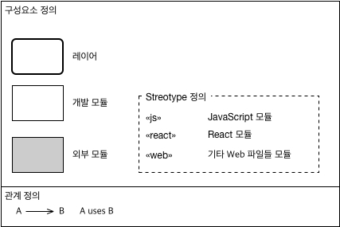
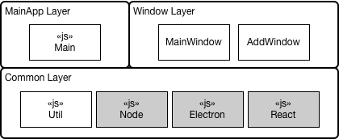
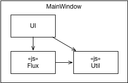
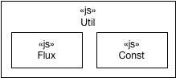
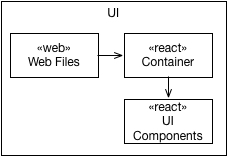

# 모듈관점\(Module Viewpoint\) 아키텍처 문서

## 1. 아키텍처 스타일
### MV-AS-1: Layered 아키텍처 스타일
모듈들의 사용관계에 있어 스파게티가 되지 않고 기본적인 통제가 가능하도록 하기 위해 Layered 아키텍처 스타일을 적용한다.

## 2. 모델 종류들
### 2.1 MV-MK-1: 1-level 모듈뷰 아키텍처 모델 종류 정의

1-level 모듈뷰 아키텍처 모델에서는 우리가 직접 개발하는 모듈(개발 모듈)들과 라이브러리, 프레임워크 등에서 참조하는 외부 모듈(외부 모듈)들을 구분하여 표시하고, 이들 사이의 사용 관계를 표현한다. 여기서 모듈이라 함은 최종적으로 코드뷰의 소스코드 파일들로 분할(break-down)되는 논리적 그룹을 의미한다. (ECMAScript의 Module과 직접적인 관계는 없다.)

## 3. 아키텍처 모델들
### 3.1 MV-AD-1: 1-level 모듈뷰 아키텍처 모델 ([MV-MK-1](#MV-MK-1) 적용)

[MV-AS-1](#MV-AS-1)을 적용한다. 상위 Layer에서는 하위 Layer를 사용할 수 있지만 반대는 안된다. MainApp Layer와 Window Layer도 서로 사용하지 않는다. 사용은 오직 상위에서 하위로만 가능하다.

### 3.2 MV-AD-2: 2-level 모듈뷰 아키텍처 모델 ([MV-MK-1](#MV-MK-1) 적용)

[MV-AD-1](#MV-AD-1)/`MainApp Layer`의 `MainWindow` 모듈을 분할한 모델이다. 총 3개의 서브 모듈로 이루어져 있다. [LV-AS-2](./logical-viewpoint.md#LV-AS-2)를 적용하여 `Flux` 모듈을 설계에 넣었고, 이 안에 Store, Action 개념을 구현한 모듈이 포함된다. UI를 전담하는 HTML, CSS, React 컴포넌트들은 `UI` 모듈에 구현된다. `Util`은 `MainWindow` 모듈에서만 사용되는 Utility 모듈이다.

### 3.3 MV-AD-3: 2-level 모듈뷰 아키텍처 모델 ([MV-MK-1](#MV-MK-1) 적용)

[MV-AD-1](#MV-AD-1)/`Common Layer`의 `Util` 모듈을 분할한 모델이다. [LV-AS-2](./logical-viewpoint.md#LV-AS-2)를 적용하여 `Flux` 모듈을 설계에 넣었고, 이 안에는 `Window Layer`에서 사용할 Store, Dispatcher 개념을 구현한 모듈이 포함된다. `Const` 모듈은 각종 상수값들을 구현한다.

### 3.4 MV-AD-4: 3-level 모듈뷰 아키텍처 모델 ([MV-MK-1](#MV-MK-1) 적용)

[MV-AD-2](#MV-AD-2)/`UI` 모듈을 분할한 모델이다. `Container` 모듈을 따로 설계하여, UI 모양만 담당하는 Presentational component와 구분하였다. `Container` 모듈에서 각종 초기화를 담당하고 `UI Components` 모듈에서 UI 모양을 결정하는 본격적인 React UI 컴포넌트들이 구현된다.

## 추적성

Logical View | Module View
-------------|------------
LC01 | `MainApp Layer`/`Main`
LC02 | `Window Layer`/`MainWindow`
LC03 | `Window Layer`/`AddWindow`
LC05 | `Window Layer`/`MainWindow`/`UI`
LC06 | `Common Layer`/`Util`/`Flux`
LC07 | `Common Layer`/`Util`/`Flux`, `Window Layer`/`MainWindow`/`Flux`
LC08 | `Window Layer`/`MainWindow`/`Flux`

기타 모듈들은 양쪽 뷰의 특성상 표현되지 않음.