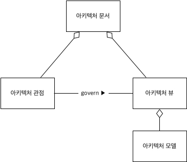

# 아키텍처 문서

## 개요

순방향 소프트웨어 개발 절차에서는 요구사항 도출 후 소프트웨어 아키텍처 설계를 진행하고, 이를 기반으로 코드를 작성한다. 하지만 MyWorkshop:Stock은 규모가 작고, 특정 기술들\(React, Electron, JavaScript 등\)을 학습하기 위한 프로토타입이기 때문에, 이러한 과정을 거치지 않았다. 그래서 본 문서는 기존 소프트웨어 아키텍처 문서의 목적 보다는 다음과 같은 목적들에 더 중점을 갖고 기록되었다.

1. 현재 코드와 어플리케이션 작동 구조를 추상화하여 이해한다.
2. 개발이 확장되어감에 있어 지켜져야 할 전체적인 구조와 제약사항을 기록한다.

## 아키텍처 관점\(Viewpoint\) 체계

본 문서는 여러 아키텍처 관점들 중에서 실행 측면의 논리관점\(Logical Viewpoint\), 코드 측면의 모듈관점\(Module Viewpoint\), 코드관점\(Code Viewpoint\)을 사용해서 아키텍처를 설계하였다. 관점\(Viewpoint\), 뷰\(View\), 모델\(Model\)들이 관계는 소프트웨어 아키텍처 문서화 표준인 [IEEE:42010](http://www.iso-architecture.org/ieee-1471/)을 따랐다. \(아래 그림 참조\)

### 아키텍처 관점 명세 포멧

IEEE 42010에서는 아키텍처 관점 명세를 위한 템플릿을 제공한다. 이 템플릿에는 이해관계자(Stakeholder), 그들의 관심사항(Concern)을 먼저 명세하고, 모델 종류(Model Kind)들과 아키텍처 모델을 차례로 명세한다. 그 후 마지막으로 아키텍처 명세를 구성하는 요소들(관점, 뷰, 모델 등) 사이의 관계(추적성, 일관성, 포함관계 등)를 명세하고 마친다. 이들 중 이해관계자와 관심사항은 나에겐 별로 중요한 사항이 아니니 제외하고, 마지막 요소(Correspondence라고 부른다)는 뷰와 모델 사이의 추적성만을 명세한다. 그리고 추가로 만약 특정 아키텍처 스타일을 적용하였다면, 어떤 아키텍처 스타일을 적용하였고, 이 것을 어떤 모델에서 확인할 수 있는지를 명세하는 단계를 맨 처음에 명세한다. 결과적으로 다음과 같은 포멧으로 명세한다.

1. 아키텍처 스타일 (선택)
1. 모델 종류들
2. 아키텍처 모델들 (다이어그램들)
3. 추적성

### 각 관점별 아키텍처 문서

1. [논리관점\(Logical Viewpoint\) 아키텍처 문서](./logical-viewpoint.md)
2. [모듈관점\(Module Viewpoint\) 아키텍처 문서](./module-viewpoint.md)
3. [코드관점\(Code Viewpoint\) 아키텍처 문서](./code-viewpoint.md)
